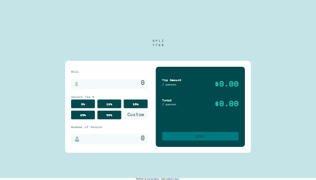

# Frontend Mentor - Tip calculator app solution

This is a solution to the [Tip calculator app challenge on Frontend Mentor](https://www.frontendmentor.io/challenges/tip-calculator-app-ugJNGbJUX). Frontend Mentor challenges help you improve your coding skills by building realistic projects.

## Table of contents

- [Overview](#overview)
  - [The challenge](#the-challenge)
  - [Screenshot](#screenshot)
  - [Links](#links)
- [My process](#my-process)
  - [Built with](#built-with)
- [Author](#author)

**Note: Delete this note and update the table of contents based on what sections you keep.**

## Overview

### The challenge

Users should be able to:

- View the optimal layout for the app depending on their device's screen size
- See hover states for all interactive elements on the page
- Calculate the correct tip and total cost of the bill per person

### Screenshot
#### mobile version

#### mobile version activated version

#### desktop version

#### desktop version

### Links

- Solution URL: [Github](https://github.com/m-nkosi/Tip-Calculator)
- Live Site URL: [Netlify](https://lambent-pony-603aa1.netlify.app)

## My process

### Built with

- Semantic HTML5 markup
- CSS custom properties
- Flexbox
- [JQuery](https://jquery.com/) - JS library

x

## Author

- Website - [Mxolisi Nkosi](https://www.your-site.com)
- Frontend Mentor - [@m-nkosi](https://www.frontendmentor.io/profile/m-nkosi)
- linkedin - [Mxolisi Nkosi](https://www.linkedin.com/in/mxolisi-nkosi-228078239/)

